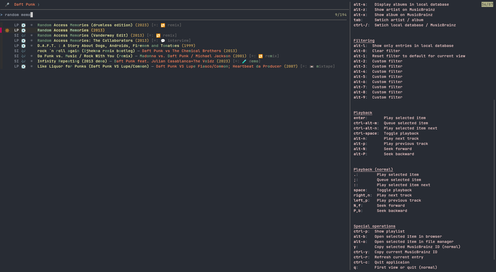
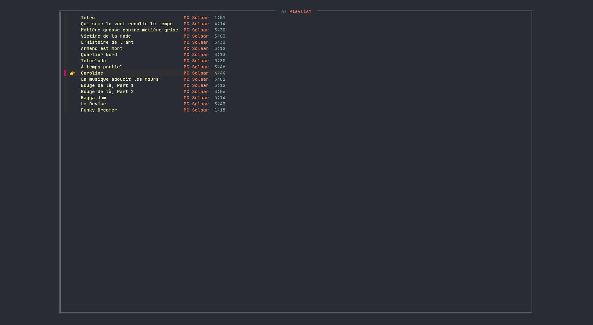

🎧 Description and Use Case
---------------------------
This application allows for a keyboard-controlled maneuvering of your music library and the MusicBrainz database. 
Your local library becomes "embedded" in MusicBrainz, and all metadata remains up-to-date without the need of tagging your files.
Control playback from your terminal while browsing the vast world of music releases.

🔍 Key Features
---------------
- [Fuzzily](https://github.com/junegunn/fzf) browse your music library
- Treat your local library as part of the [MusicBrainz universe](https://musicbrainz.org)
- Search the MusicBrainz database and discover music artists and releases
- Handle metadata without touching your audio files
- Fast and hackable application with [vim](https://www.vim.org)-like keybindings
- Save and load playlists

🎞️ Screenshot
-------------
### Search Artist on MusicBrainz
The MusicBrainz database is automatically searched after entering a query.
In the screenshot below, the emoji 🔆 indicates that some tracks of _Mc Solaar_ are available in the local music library.
They are played by hitting `<enter>`.


### Browse Local Music Library
Here, we fuzzily search an album of _Daft Punk._
The LP _Random Access Memories_ can be appended to the playlist by pressing `ctrl-alt-m`.
Alternatively, you may switch back to normal mode (`esc`) and then hit `;`.


### Playlist Control
You can easily control playback and edit the playlist in the playlist view.


🛠️ Requirements and Installation
--------------------------------
### Requirements
This is an almost[^1] POSIX-compliant shell script with inline `awk` elements (GNU flavored, we couldn't resist) that makes calls to:
- the command-line fuzzy finder [fzf](https://junegunn.github.io/fzf/),
- the command-line data transferrer [curl](https://curl.se),
- the command-line JSON processor [jq](https://jqlang.org),
- the command-line media player [mpv](https://mpv.io), and
- the command-line multipurpose relay [socat](http://www.dest-unreach.org/socat/).

[^1]: It is written in POSIX style, but we make use of zero terminated strings.

The following may improve your experience:
- the command-line multimedia prober [ffprobe](https://ffmpeg.org/ffprobe.html) _(optional, for automatic release detection)_,
- the command-line clipboard [xsel](http://www.kfish.org/software/xsel/) _(optional, for yanking urls)_,
- Noto fonts _(optional, for emojis in your terminal)_.

### Installation
Run `./scripts/build.sh`, then copy `fuzic` to your preferred location, e.g., `~/.local/bin`, and make it executable.

🧩 Configuration
-----------------
Although **no configuration** is needed, this application may be customized using environment variables.
If the file `$XDG_CONFIG_HOME/fuzic/config` (defaults to `$HOME/.config/fuzic/config`) exists, then it will be sourced.
You may also specify an alternative location of the configuration file with the environment variable `CONFIGFILE`.

The **appearance** of the application is controlled using the environment variables defined in `src/sh/theme.sh`.
The directory `share/theme` contains example themes.
You may execute `CONFIGFILE=share/theme/plain.sh fuzic` to launch `fuzic` using an emojiless and colorless theme.

Custom **filters** can be defined using the environment variables from `src/sh/filter.sh`.
For instance, when you launch `F_2_LIST_ARTISTS="jazz" fuzic`, then the artist list can be queried for the word `jazz` by pressing `alt-2`.

Also the **key bindings** can be reconfigured to your liking.
For that, adjust the environment variables defined in `src/sh/keys.sh`.

Finally, you can **sort** the artists according to their [sort name](https://musicbrainz.org/doc/Style/Artist/Sort_Name) by specifying `SORT_ARTIST_DEFAULT=sort-artist-sortname`,
and the switch to alphabetical release-group sorting via `SORT_RG_DEFAULT=sort-rg-title`.


▶️ Usage
--------
For a quick start, run the application and hit `alt-?` to display the available key-bindings.
You may also open the application in one of the following predefined modes:
```
Usage: fuzic [OPTION]

GENERAL OPTIONS:
  --help                        Show this help and exit
  --artists                     Default options, list artists of local music
  --albums                      List albums of local music
  --search-artist               Search artist on MusicBrainz
  --search-album                Search album on MusicBrainz
  --artist <mbid>               List release groups of given artist <mbid>
  --releasegroup <mbid>         List releases in given release group <mbid>
  --release <mbid>              Show release given by <mbid>
  --playlists                   List stored playlists and exit
  --load-playlist <playlist>    Load specified playlist

MANAGE LOCAL MUSIC:
  --decorate <path>             Decorate directory containing a tagged release
  --decorate-as <path> <mbid>   Decorate directory as the relase <mbid>
  --reload-database <path>      Populate database with decorated local music from <path>
```


🗄️ Local Music Library
----------------------
Instead of reading the tags from audio files, this application uses **decorations.**
The decoration of a folder is a JSON file that stores the relevant MusicBrainz IDs of the release the folder corresponds to. 
This assumes that complete releases are stored within separate folders.
The application then fetches the relevant metadata, which is displayed to the user.
Folders can be decorated using `fuzic --decorate <path>` or `fuzic --decorate-as <path> <mbid>` commands.
The first version may be used on previously tagged files (using, e.g., [MusicBrainz Picard](https://picard.musicbrainz.org/)).
With this command, the folder gets decorated with the MusicBrainz IDs extracted from the files.
The latter version does not require the files to be tagged.
Instead, it decorates the files found in that folder as the release given by the [MusicBrainz Release ID](https://musicbrainz.org/doc/MusicBrainz_Identifier) `<mbid>`.

After decorating your folders, you may run `fuzic --reload-database <path>` to build your music library.
This command searches the path specified for decorated folders.
Once the local music library is built, it will display automatically when `fuzic` is launched.

### Workflow Example
```
$ fuzic --decorate ~/Music/Daft\ Punk/Random\ Access\ Memories 
Info: Decorating /home/amin/Music/Daft Punk/Random Access Memories as release 5000a285-b67e-4cfc-b54b-2b98f1810d2e
$ fuzic --decorate-as ~/Music/Mc\ Solaar/Prose\ Combat 69e5cf67-7cea-4fe8-9129-9779f0a93d69
Info: Decorating /home/amin/Music/Mc Solaar/Prose Combat as the release Prose Combat by MC Solaar
Info: We discovered the following associatoin:
Track 'Aubade'                         File './01 Aubade.m4a'
Track 'Obsolète'                       File './02 Obsolète.m4a'
Track 'Nouveau western'                File './03 Nouveau western.m4a'
Track 'À la claire fontaine'           File './04 À la claire fontaine.m4a'
Track 'Superstarr'                     File './05 Superstarr.m4a'
Track 'La Concubine de l’hémoglobine'  File './06 La Concubine de l’hémoglobine.m4a'
Track 'Dévotion'                       File './07 Dévotion.m4a'
Track 'Temps mort'                     File './08 Temps mort.m4a'
Track 'L’NMIACCd’HTCK72KPDP'           File './09 L’NMIACCd’HTCK72KPDP.m4a'
Track 'Séquelles'                      File './10 Séquelles.m4a'
Track 'Dieu ait son âme'               File './11 Dieu ait son âme.m4a'
Track 'À dix de mes disciples'         File './12 À dix de mes disciples.m4a'
Track 'La fin justifie les moyens'     File './13 La fin justifie les moyens.m4a'
Track 'Relations humaines'             File './14 Relations humaines.m4a'
Track 'Prose combat'                   File './15 Prose combat.m4a'
Info: Are the track correctly associated to the audio files? (yes/no) yes
$ fuzic --reload-database ~/Music
Info: Reloading information of local music directory /home/amin/Music
Info: Fetching missing releases
Info: 1/2 (5000a285-b67e-4cfc-b54b-2b98f1810d2e: Random Access Memories)
Info: 2/2 (69e5cf67-7cea-4fe8-9129-9779f0a93d69: Prose Combat)
Info: Fetching missing release groups
Info: 1/2 (aa997ea0-2936-40bd-884d-3af8a0e064dc: Random Access Memories)
Info: 2/2 (b199910b-0f90-3c88-b523-d6852b7612d3: Prose Combat)
Info: Fetching missing artists
Info: 1/2 (056e4f3e-d505-4dad-8ec1-d04f521cbb56: Daft Punk)
Info: 2/2 (bbbd2644-b4cb-4bb5-a442-315310f68a0b: MC Solaar)
Info: Done
```

⌨️ Basic Keys
-------------
As mentioned above, you may hit `alt-?` anytime to display the possible keys.
Note that `fuzic` allows for two modes: _normal mode_ and _insert mode._
Similar to `vim`, keys pressed in the _normal mode_ do not directly write to the input field, but are instead bound to other actions.
For instance, the keys `j` and `k` can be used to navigate the list down and up.
In the insert mode, triggered using `i`, `a`, or `/`, the keys directly modify the input field. 

Some central keys are `<enter>` to start playback of the selected entry, `<space>` to pause playback, and `ctrl-p` to open the currently loaded playlist.

📝 Playlist Store
-----------------
Playlists can be saved, loaded and _shared._
To save a playlist, simply press `ctrl-s` when viewing your playlist.
To load a playlist, open the playlist store using `ctrl-o` while viewing your playlist.
Alternatively, you may start `fuzic` using the command-line parameters `fuzic --load-playlist <playlist>`.
Under the hood, a playlist is not more than a sequence of MusicBrainz IDs.
This means that `fuzic` users may share their playlists irrespective of the audio file locations and formats.
Possibly even more importantly, this means that you can preserve your playlist even if you reorganize your local music library:
You can safely share your playlists with your future self.

Playlists are stored under `XDG_DATA_HOME/fuzic/playlists`, which defaults to `~/.local/share/fuzic/playlists`.
You may also define the playlist directory using the `PLAYLIST_DIRECTORY` environment variable.
In `share/playlists` you find example playlists.
Thus, the command `PLAYLIST_DIRECTORY=share/playlists fuzic` launches this application with access to these example playlists.

📜 Lyrics
---------
By using the key `L` (normal mode), the lyrics of the selected track are displayed.
The lyrics are taken from (in that order)
1. the lyrics stored using `fuzic`, or
2. from the `.lrc` file with the same name as the audio file, or
3. from the audio-file tags (requires `ffprobe`), or
4. from a custom script.

To specify the custom script, you can set the `LYRICS_FETCH_CUSTOM` environment variable to point to an executable.
The executable reads a JSON string on the standard input, and is supposed to print the lyrics (see `share/lyrics/example.sh`).

You may also skip the first three sources and directly make a call to your custom script by using the key `Y` (normal mode).

The key `alt-L` opens the lyrics in a new window using the `EDITOR`.
This requires one of the following terminal emulators (`kitty`, `x-terminal-emulator`, `gnome-terminal`, `xterm`).
If you use another terminal emulator, you may specify the environment variable `EXTERNALEDIT` to hold the string such that
```sh
$ExTERNALEDIT "$file"
```
spawns a text editor with `$file` loaded inside a terminal emulator.

🧭 Planned Features
-------------------
The following features are planned:
- cover art and artist images
- genre support
- MusicBrainz collections and favorites

🌐 Information Sources
----------------------
Main metadata is fetched from the MusicBrainz database.
This application also access [wikidata](https://wikidata.org), [wikipedia](https://en.wikipedia.org), and [discogs](https://www.discogs.com).
In the future, more sources may be added.

License
-------
This project is licensed under the [MIT License](./LICENSE).
